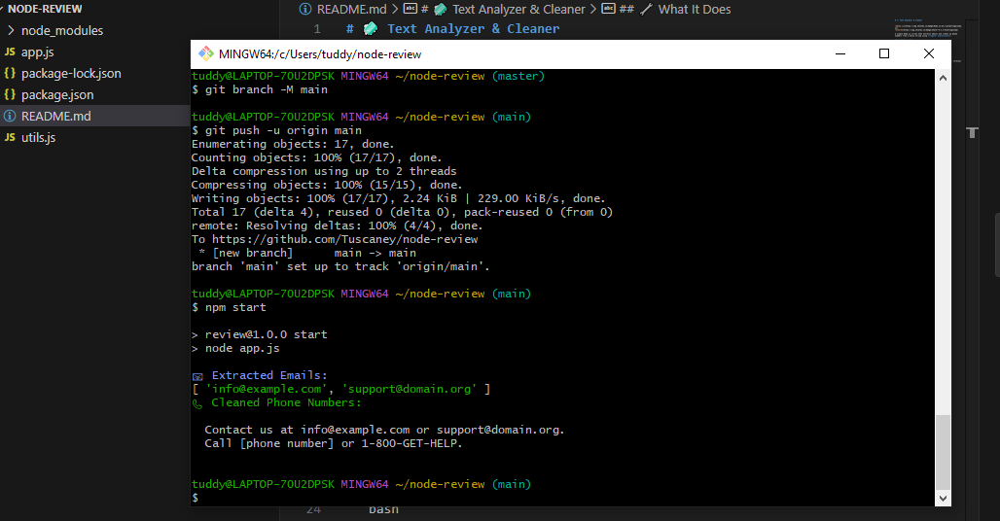

# 🧼 Text Analyzer & Cleaner


A simple Node.js script that extracts emails and cleans up phone numbers from a messy string using **regular expressions**.

## 🔧 What It Does

- Extracts email addresses using regex
- Replaces phone numbers with `[phone number]`
- Formats output using the **chalk** package

## 📦 Built With

- Node.js (ES Modules)
- Regex
- Custom utility functions (`utils.js`)
- [Chalk](https://www.npmjs.com/package/chalk) for colorful terminal output

## 🧪 Sample Output

```bash
📧 Extracted Emails:
[ 'info@example.com', 'support@domain.org' ]

📞 Cleaned Phone Numbers:
  Contact us at info@example.com or support@domain.org.
  Call [phone number] or [phone number].

  ## 📸 Example Output



